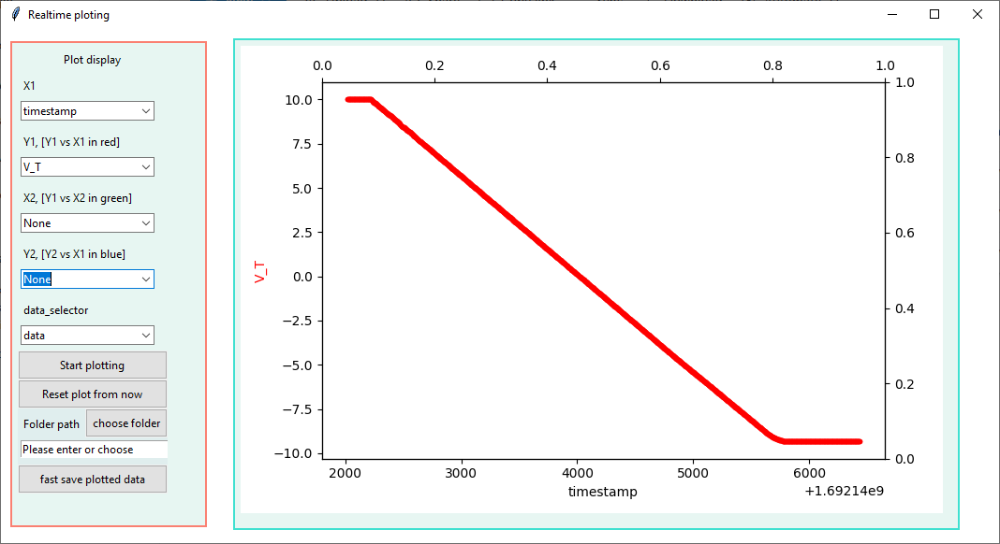
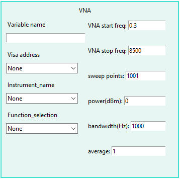
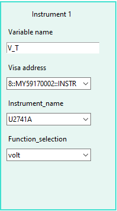
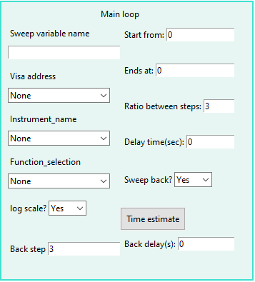
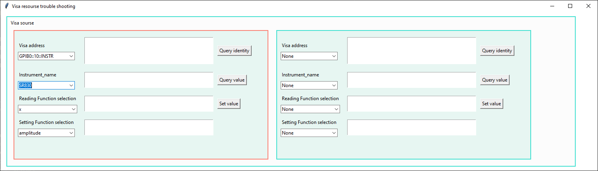
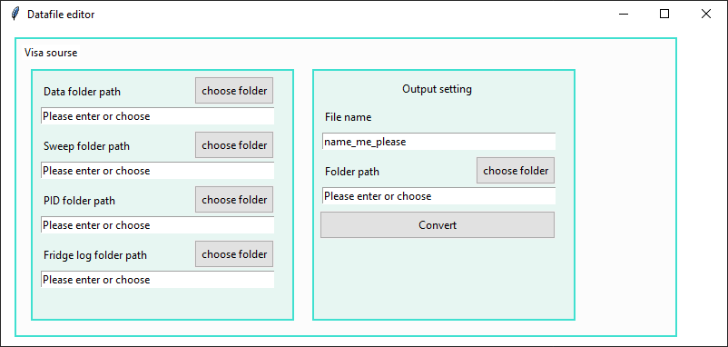

# Project Name: Simple_DAQ

## Table of Contents
1. [Introduction](#introduction)
2. [Installation](#installation)
	- [Graphical Interface Guide](#graphical-interface-guide)
	- [Command-line Guide](#command-line-guide)
3. [Features](#features)
4. [Usage](#usage)
    - [Quick Start](#quick-start)
    - [Advanced Usage](#advanced-usage)
5. [FAQ](#faq)
6. [Contributing](#contributing)

## Introduction

**Simple_DAQ** is a Python-based, user-friendly interface tailored for data acquisition from prevalent instruments in the Henriksen lab.


This project draws inspiration from an earlier LabVIEW version of SimpleDAQ.vi that was a staple in the Henriksen lab. The decision to reimagine it stemmed from recurring challenges faced with the LabVIEW iteration: transferring it between PCs often led to failures due to broken dependencies with sub VIs. Additionally, integrating new instrument drivers became a challenge when manufacturers lacked a robustly written one.


## Installation

### Graphical Interface Guide

#### 1. Download the Simple_DAQ Repository

- Visit the [Simple_DAQ GitHub repository](https://github.com/Henriksen-Lab/Simple_DAQ).
- Click on the green `Code` button on the right.
- Choose `Download ZIP`.
- Once downloaded, extract the ZIP file to a location of your choice.

#### 2. Install Anaconda

Anaconda is a popular distribution of Python that simplifies package management and deployment.

- [Download Anaconda](https://www.anaconda.com/products/distribution) for your operating system.
- Follow the installation instructions for your operating system from the [Anaconda installation guide](https://docs.anaconda.com/anaconda/install/).

#### 3. Setting Up a Virtual Environment with Anaconda Navigator

Anaconda Navigator is a GUI tool that comes with the Anaconda distribution.

1. Open **Anaconda Navigator** from your applications or programs list.
2. Click on `Environments` on the left sidebar.
3. Click on `Create` at the bottom.
4. Name it `simple_daq_env` and choose the Python version you want (e.g., 3.X). Click on the `Create` button.
5. After the environment is created, make sure it's activated (should be highlighted in green).

#### 4. Setting Up Your IDE and Installing Dependencies

##### For PyCharm:

1. Open PyCharm and choose `Open` to load the `Simple_DAQ` directory you extracted from the ZIP file.
2. Once the project is open, navigate to `File` > `Settings` (or `Preferences` on macOS) > `Project: Simple_DAQ` > `Python Interpreter`.
3. Click on the gear icon and choose 'Add'.
4. From the left pane, select 'Conda Environment' and then 'Existing environment'.
5. Select the interpreter from the `simple_daq_env` environment you created in Anaconda Navigator. The path would typically be in the Anaconda directory under `envs/simple_daq_env/bin/python`.
6. To automatically install the required packages, navigate to `Tools` in the top menu and select `Sync Python Requirements`. This will read the `requirements.txt` file and install all necessary packages.

##### For VSCode:

1. Open the `Simple_DAQ` directory (that you extracted from the ZIP file) in VSCode.
2. Press `Ctrl + Shift + P` to open the command palette.
3. Type and select "Python: Select Interpreter".
4. Choose the interpreter from the `simple_daq_env` environment you created in Anaconda Navigator.
5. Open the terminal in VSCode (View > Terminal) and type:

```bash
pip install -r requirements.txt
```

### Command-line Guide

#### 1. Clone the Repository

To get started, first clone the Simple_DAQ repository from GitHub:

```bash
git clone https://github.com/Henriksen-Lab/Simple_DAQ.git
```

Navigate to the cloned directory:

```bash
cd Simple_DAQ
```

#### 2. Set Up a Virtual Environment

**Using Python's built-in venv:**

```bash
# Using venv module for Python
python -m venv venv

# Activate the virtual environment
# For Windows
venv\Scripts\activate

# For macOS and Linux
source venv/bin/activate
```

**Using Anaconda (if installed):**

```bash
conda create --name simple_daq_env python=3.X
conda activate simple_daq_env
```

Replace `3.X` with your desired Python version.


#### 3. Install Dependencies

To install the required packages,

```bash
pip install -r requirements.txt
```


## Features

While the Python version maintains the UI style of the original LabVIEW version, it introduces several enhancements to improve user convenience.

- **Configuration Management**:
  
  - **Save**: The *Measurement Set-up* window captures the current settings as a screenshot and saves it to a designated folder. The file is named `[Filename]_Simple_DAQ_config` and is saved whenever the `Save config` or `Run` buttons are pressed.
  - **Load**: You can revert to previous settings at any time by using the `Load config` button. This feature is especially handy for reviewing past measurement configurations or for initiating new measurements with similar settings.

- **Real-Time Data Visualization**:

  The *Realtime plotting* window provides live data visualization, allowing you to see measurements as they are being taken.

- **Instant Data Backup**:

  Within the *Realtime plotting* panel, a special button allows you to quickly save the visualized data. The saved data is named `temp` and stored in a designated folder. This function is beneficial for safeguarding against potential data loss, such as accidental file corruption (which might occur if files are being synced to cloud storage while concurrently being modified by the program). It also provides a method to keep a separate copy of continuous data.


## Usage

### Quick Start

1. **Safety First**:
    - Before initiating any measurements, ensure you're knowledgeable about the equipment and the measurements you're planning. Ensure connections are correct and that the readings are sensible. Proceeding without this confirmation can lead to wasted time and inaccurate data.

2. **Initial Setup**:
    - Begin by following the installation instructions provided.
    - In your IDE, execute the `Simple_DAQ_beta.py` file. Two windows named `Specify your measurement below` and `Realtime plotting` will appear.




3. **Measurement Specification Window**:
    - This window primarily contains three fields: `Instrument`, `File`, and `Sweep`.

4. **File Configuration**:

    

    - Determine a `File name` for your data.
    - Specify the `Folder path` where data should be saved.
    - Determine the `order` of your files. Input should be an integer. E.g., default data will save as `name_me_please.001`.
    
        **Note**: If a file with the same name and order already exists, the program will automatically increment the order by one to prevent overwriting.

    - Set the `File size`. Input should be an integer. This represents the number of data points the program will save at once. E.g., an input of 1000 means the data file will be updated after 1000 data points are acquired.
    - Specify the `Data interval`, using a positive float number. This defines the time gap between successive instrument value queries.
    - Use the `My note` field to document any relevant information about the device or physical setup. This helps in future data analysis.

5. **Instrument Configuration**:
    - The far-left block is reserved for VNA-type instruments. Remaining blocks are for instruments that return a single value.

    
    

    - Assign a `Variable name` which will represent this in your data set.
    - Fill in the `Visa address`, verifiable via NI MAX software or `Visa_troubleshooting.py`.
    - Choose your `Instrument_name` and `Function_selection` for specific data recording.
    
        **Note**: To avoid VISA communication issues, only one instrument is communicated with at any given time.

6. **Sweep Configurations**:
    - This panel contains: `Main loop`, `Secondary loop`, and `PID control`.
    - For a single parameter sweep, fill in the `Main loop`:

        

        - Instrument settings mirror those in the instrument panel.
        - Sweep settings include `Start`, `Stop`, `Sweep step size`, and `Delay time`.
        - Toggles include:
            - `Log scale?`: Toggles between linear and ratio sweeps. With this enabled, `Sweep step size` changes to `Ratio between steps`. A value greater than 1 is advised.
            - `Sweep back?`: Returns the sweep to the start point. Additional configurations like `Back step` and `Back delay` are available for costumizing, or it keeps to original settings.
        - Click `Time estimate` to view an estimated duration for the sweep.

    - For a double parameter sweep, use both the `Main loop` and `Secondary loop`. The program completes the entire secondary loop for every main loop step.
    - Use `PID control` for temperature regulation. Options here include `IceT noise setup` and `NV transfer setup`.	
	<!-- (Refer to [Advanced Usage](#advanced-usage)).  -->
	

7. **Initiating the Measurement**

    Once you click the `Run` button, your IDE will display a sequence of status updates, which might include:

    ```bash
    Measurement loaded
    Monitor functioning            # Displayed when no sweep is set up.
    Single Sweep Starting          # Displayed for Mainloop sweep configuration.
    Double Sweep Started           # Displayed when both Mainloop and Secondary loop configurations.
    ```

    Over time, as the data files are created or updated, you'll notice additional messages like:

    ```bash
    2023.08.16      11:16:36        name_me_please.001
    Data file created.
    2023.08.16      11:26:36        name_me_please.001
    Data file updated.
    2023.08.16      11:36:36        name_me_please.001
    Data file updated.
    ```

8. **Visualizing Data with the Plot Window**

    **Select Data**:
    - Navigate to `data_selector` to specify the data category you'd like to visualize. Your options might be:
        - `data`: Represents data to be saved in files
        - `sweep`: Refers to internal record for you sweep parameters
        - `pid`: Indicates the temp log from the PID set up

    **Define Axes**:
    - Determine which parameters you want on the X1 and Y1 axes for your graph.

    **Begin Visualization**:
    - Click on `Start plotting`. A live-updating plot will subsequently appear on the right side of the screen.


### Advanced Usage

#### **1. `Visa_troubleshooting.py`**
This tool is particularly useful when you need to test individual instruments or make simultaneous manual adjustments. Its primary purpose is to validate the connection and assess the functionality of a single instrument.


#### **2. `Datafile editor.py`**
When you've captured data on different computers and wish to synchronize their timestamps, this tool comes to the rescue. It efficiently concatenates identically formatted data (with matching axes) found within a folder. By comparing diverse timestamps, it aligns data and then exports the newly consolidated data to the specified folder.


#### **3. `Instrument_Drivers`**

- **`Instrument_dict.py`**:
    This contains the nomenclature and functionalities associated with the drivers.

#### To Incorporate Additional Instruments or Functions:

**1.** Start by editing or adding the desired function/driver within the `Instrument_Drivers` directory.

**2.** If you're introducing a new driver:
  
- Import the new driver in `Instrument_dict.py`

**3.** **Integrating a New Driver or Function**:

Whenever you add a new driver or function:

- Update the `get_value()` and `set_value()` functions in `Instrument_dict.py` to accommodate the new additions.
  
- Make appropriate modifications to the `instrument_dict` in `Instrument_dict.py`.

**For Instance**:

Suppose you've created a new driver, `SampleInstrument.py`, housing several functions like follows, and you've placed this in the `Instrument_Drivers` directory.

```python
def SampleInstrument_get_random1(address):
    ...
    return value

def SampleInstrument_get_random2(address):
    ...
    return value

def SampleInstrument_set_random3(address, value):
    ...

def SampleInstrument_set_random4(address, value):
    ...
```

To integrate this in `Instrument_dict.py`, proceed as follows:

- Incorporate the new driver by adding:

```python
from SampleInstrument import *
```

- Enhance the `instrument_dict` to include the new functions:

```python
instrument_dict['get'].update({SampleInstrument: ['random1', 'random2']})
instrument_dict['set'].update({SampleInstrument: ['random3', 'random4']})
```

- Embed the new functions into the `get_value` and `set_value` procedures:

```python
def get_value(address='', name='', func='', **kwargs):  # Extend this function
    ...
    elif name == 'SampleInstrument':
        if func == 'random1':
            value = SampleInstrument_get_random1(address)
        elif func == 'random2':
            value = SampleInstrument_get_random2(address)
```

```python
def set_value(value, address='', name='', func='', **kwargs):  # Expand this function
    ...
    elif name == 'SampleInstrument':
        if func == 'random3':
            SampleInstrument_set_random3(address, value)
        elif func == 'random4':
            SampleInstrument_set_random4(address, value)
```

**4.** Before pushing your changes to GitHub **(and please do so if you add new drivers/functions)**, ensure that the `Visa_troubleshooting.py` correctly displays the intended readouts or causes the instrument to behave as desired.


### Folder Tree
```
├── Simple_DAQ_beta.py
├── Visa_troubleshooting.py
├── Datafile editor.py
├── UI_manager
│   ├── DataManager.py
│   └── _ini_.py
├── Customized
│   ├── LYW_plot_universal.py
│   ├── SD_picoVNA_py32bit.py
│   ├── SD_plot
│   │   ├── SD_FigureFormat.py
│   │   ├── SD_Func.py
│   │   ├── SD_LoadData.py
│   │   ├── SD_plot_universal.py
│   │   ├── __pycache__
│   │   └── _ini_.py
│   └── SD_pywin32error.sh
├── requirments.txt
├── README.md
├── LICENSE
├── Instrument_Drivers
│   ├── _ini_.py
│   ├── FileManager.py
│   ├── Instrument_dict.py
│   ├── Agilent_infiniVision.py
│   ├── DC205.py
│   ├── E4405B.py
│   ├── Keysight_U2741A.py
│   ├── PicoVNA108.py
│   ├── PicoVNA Python Wrapper(folded)
│   ├── SR124.py
│   ├── SR770.py
│   ├── SR830.py
│   ├── hp34461A.py
│   ├── keithley.py
│   ├── keithley2230G_30_1.py
│   ├── keysightN6700c.py
│   ├── thermometer
│   │   ├── _ini_.py
│   │   ├── RuOx.py
│   │   └── Cernox.py
│   ├── noise_probe_PID.py
│   ├── noise_probe_arduino_control.py
│   ├── Arduino_run_noise_probe
│   │   └── Arduino_run_noise_probe.ino
│   ├── transfer_heater_PID.py
│   ├── transfer_heater_arduino_comm.py
│   ├── Arduino_run_transfer_Heater
│   │   └── Arduino_run_transfer_Heater.ino
│   └── vna_analysis.py
└── older reference(folded)
```


## FAQ

Problems you may encounter and possible solution:

- **Q**: What to do if error messages show up with `pyvisa.errors.VisaIOError` or something similar?
    * **A**: Check you GPIB/Usb connection and visa addressesa. Make sure you can see the instrument in NI MAX softerware with the same Visa address as your input.

## Contributing

Xinyi Du (Shilling) (2021-2023)
